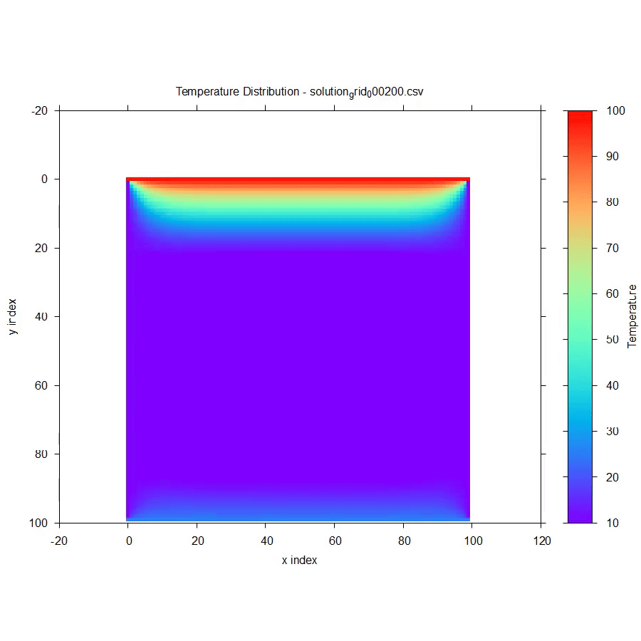

# Transient heat diffusion solver 
This tool numerically solves the transient 2D heat diffusion equation and visualizes the evolving temperature field with time. The following animation shows a sample study demonstrating diffusion of heat from the domain boundaries to the domain interior areas. 

<div align="center">
  
</div>


## Governing equation and discretization
The 2D transient heat diffusiuon equation is given by
```math
\alpha \left(\frac{\partial^2 T}{\partial x^2} + \frac{\partial^2 T}{\partial y^2} \right)+ \frac{\partial T}{\partial t} = 0
```
where x and y are spatial co-ordinates and t is time. $T=T(x,y,t)$ is the temperature flow field. The term $\alpha$ is the thermal diffusivity of the material. 

Using the central difference approach, we discretize the spatial domains as
```math
\frac{\partial^2 T}{\partial x^2} \approx \frac{T^n_{i+1,j} - 2T^n_{i,j} + T^n_{i-1,j}}{\Delta x^2}

```
```math
\frac{\partial^2 T}{\partial y^2} \approx \frac{T^n_{i,j+1} - 2T^n_{i,j} + T^n_{i,j-1}}{\Delta y^2}
```
Finally, we use the forward/Euler discretization method to discretize the time domain as 
```math
\frac{\partial T}{\partial t} \approx \frac{T^{n+1}_{i,j} - T^n_{i,j}}{\Delta t}
```
where i,j and n are the indices for the x,y and t variables. 

We assume $\Delta x = \Delta y = h$ and substitute the above expressions into the governing differential equation to get the following expression: 
```math

T^{n+1}_{i,j} = T^n_{i,j} + \frac{\alpha \Delta t}{h^2}(T^n_{i+1,j} + T^n_{i-1,j}  + T^n_{i,j+1} + T^n_{i,j-1} -  4 T^n_{i,j} )

```

The solution is stable for $\Delta t \leq \frac{h^2}{4 \alpha}$
## Features
* Numerically solves 2D transient heat diffusion equation using the explicit scheme
* Important assumptions: no heat source/sink, no convective or radiative heat transfer
* Boundary conditions can be specified on the top, bottom, left and right boundaries
* Gives user option to input time step. Checks the user-specified time step against the explicit scheme stability criterion and adjusts it if necessary.
* The interior domain is initialized to zero temperature; boundary values are prescribed by the user.
* Visualize the evolving temperature distribution with time
* Save animation as video file and individual heat-maps as images
* Saves metadata for the study as a text-file within the study folder 
* Numerical computations are performed in C++, while post-processing and visualization are performed in Python. Video generation is performed by GNUPlot
* A batch file automates the process 
* User-defined study names create dedicated output folders. Temperature fields are saved as CSV snapshots every 100 iterations.

## How to use 
1. Click on the batch script run_app.bat 
2. Enter the name of your study. This will be the name of the data storage folder. If no study name is entered, a default study name "Data" is assigned. 
3. Enter the number of grids to discretize the 2D domain into 
4. Enter the thermal diffusivity value
5. Enter the desired time-step. The program checks it against the stability criteria and modifies accordingly
6. Computations are performed and the data for every 100 iterations are stored in csv files within a folder named after the study name 
7. After calculations, enter the desired time duration for the animation. If the annimation takes longer than the desired duration, the animation exits. You will be prompted whether you wish to re-run the animation again with a different desired time duration. 
8. To save video, run the following line in terminal after which, you will be prompted to enter the folder name containing the data files: 
```bash
gnuplot vid_maker.gp
```
9. Folders and files will be overwritten if the same study-name is re-used. 

## Dependencies 
1. Python libraries: Matplotlib and numpy 
2. GNUPlot 
3. ffmpeg 